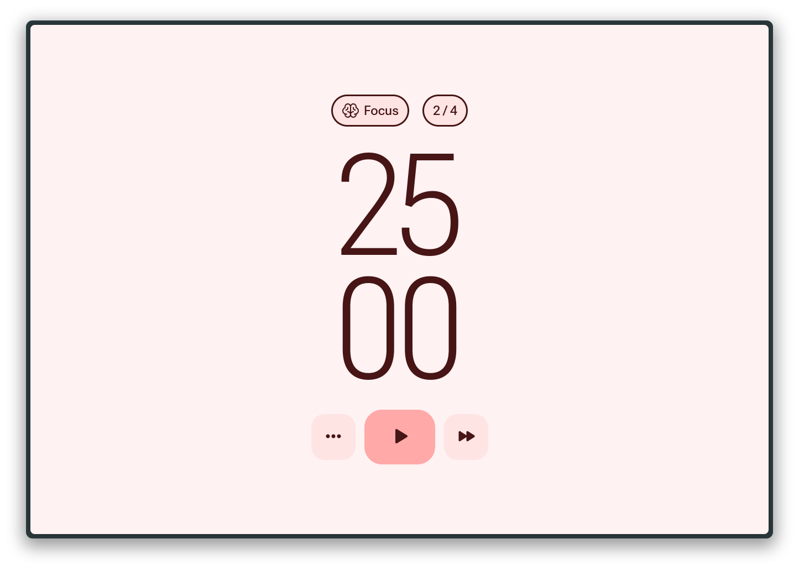

# ⏳ Preact Pomodoro



**Preact Pomodoro** is a sleek and minimal Pomodoro timer built with [Preact](https://preactjs.com/) and [Vite](https://vite.dev).
Designed as a learning project, it's both developer-friendly and user-focused — easy to run, intuitive to use, and beautifully styled based on a Figma Community prototype.

A perfect starting point for exploring modern frontend tools, or simply staying focused and productive.


## 🚀 Getting Started

```bash
git clone https://github.com/zhuravkovigor/preact-pomodoro.git

cd preact-pomodoro
pnpm install
pnpm dev
```

## 🌟 Features
- ⏱ Pomodoro timer with session and break cycles
- 🔔 Audio notification on session end
- 🎨 Elegant, clean UI inspired by Figma design
- ⚡️ Lightning-fast build with Vite
- 🪶 Ultra-lightweight footprint using Preact

## 🛠 Planned Improvements
- [x] Dark mode toggle
- [x] Configurable session/break durations
- [x] Persistent state between sessions (localStorage)
- [ ] PWA support (offline + installable)
- [x] Accessibility improvements

## 🎨 Design Inspiration
- [Original Design - Figma Community POMO](https://www.figma.com/community/file/1112830528857083939/pomo-pomodoro-timer-app-prototype-v-0-1-0)

## 📄 License
This project is licensed under the MIT License.
